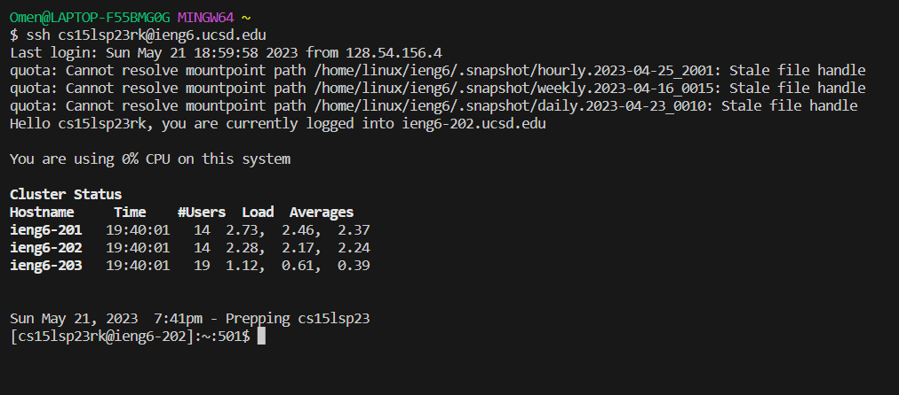
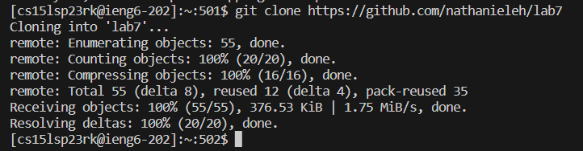
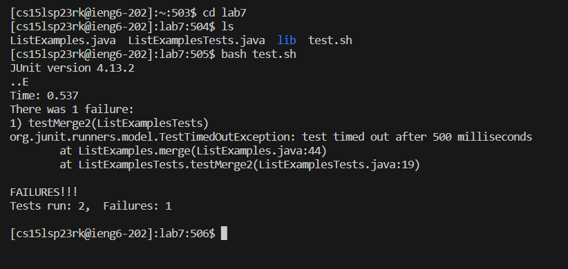
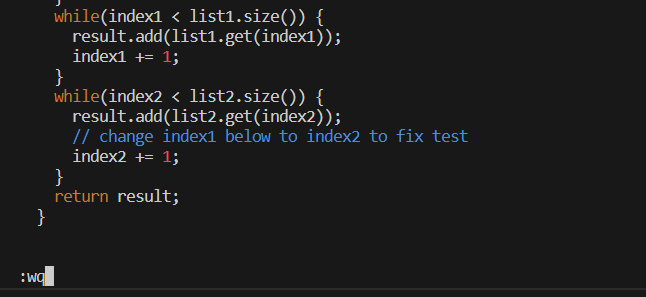
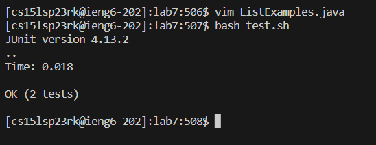
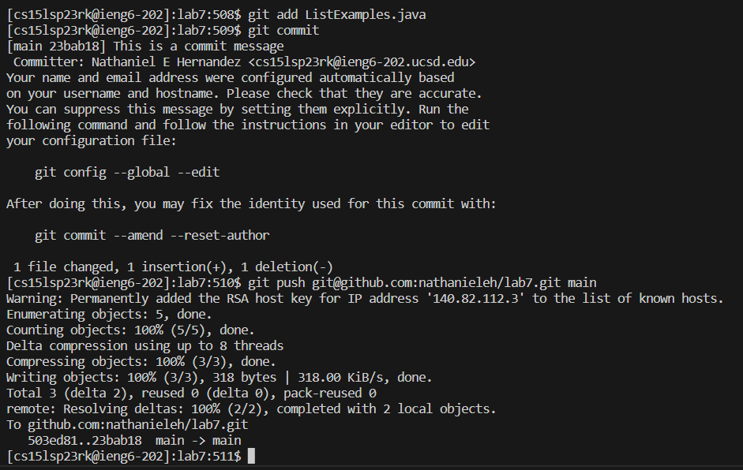

# Completing steps 4-9 of the week 7 lab assignment
## Step 4
Keys pressed:
```
ssh<SPACE>cs15lsp23rk@ieng6.ucsd.edu<ENTER>
```
Screenshot:



No special commands were used for this line of code that allows the user to securely connect with the remote host. Normally, the host will prompt for a password but because of the setup required for this lab, a key is stored for this device which allows for the user to connect without a password.
## Step 5
Keys pressed:
```
git<SPACE>clone<SPACE><CTRL+V><ENTER>
```
Screenshot:



When cloning this repository, I used `<CTRL+V>` to paste the github website where my fork was stored. I had to copy the website link from a seperate browser which had access to my github website already.
## Step 6
Keys pressed:
```
cd<SPACE>lab7<ENTER>
ls<ENTER>
bash<SPACE>t<TAB><ENTER>
```
Screenshot:



The first line simply changes my directory to have access to my files and the purpose of `ls` is to be able to see the names of all the files I have access to. The special command used for running the script to test the file was `<TAB>` which autocompletes the word that the user is currently on until there is a matching piece of text or it is at the end of the word. Since `test.sh` was the only file starting with `t`, it simply autocompleted the file name.
## Step 7
Keys pressed:
```
vim<SPACE>List<TAB>.j<TAB><ENTER>
gg/1<ENTER>18nr2:wq<ENTER>
```
Screenshot:



Once again, I used `<TAB>` to autocomplete pieces of text once again. Several vim commands were used such as: `gg` which takes the user to the top of the file, `/[text]` to find the first instance of the text inside the file and select it, `[#]n` to move to the next instance of the word a certain number of times, `r[key]` replaces the currently selected character with the key, and `:wq` to save and quit the file on vim.
## Step 8
Keys pressed:
```
bash<SPACE>t<TAB><ENTER>
```
Screenshot:



I ran the bash script to check if the change to the file was correct while using `<TAB>` again.
## Step 9
Keys pressed:
```
git<SPACE>add<SPACE> List<TAB>.j<TAB><ENTER>
git<SPACE>commit<ENTER>
i<COMMIT_MESSAGE><ESC>:wq<ENTER>
git<SPACE>push<SPACE><CTRL+V><SPACE>main<ENTER>
```
Screenshot:



The first line places files that are specified as the argument as files to be committed once the `git commit` command is ran. The second line commits the files that were added/modified to create a snapshot for the local machine to save. This prompts the user to utilize vim in order to write a commit message which coincides with the third line. `i` changes the mode of vim to insert mode which allows the user to input any text they want. Exiting out of insert mode is done with the `<ESC>` command which can allow the user to save and quit like mentioned before. The final line pushes the most recent commit to the github url that is provided as the first argument. This can be found by opening the forked repository website and selecting the green dropdown, clicking `SSH` and copying the ssh key that is provided. The second argument is meant to specify which branch the push is to be made out to which is specified as `main` for this lab exercise.
