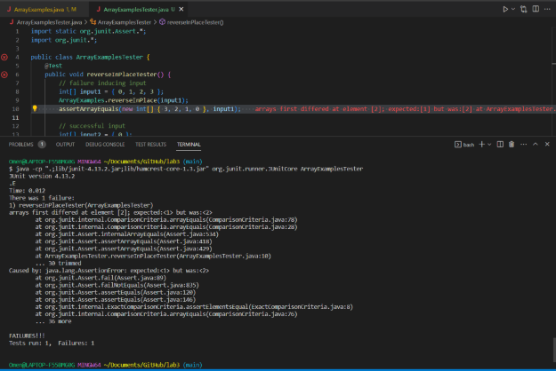

# Lab Report 2 - Servers and Bugs
## Part 1
```
import java.io.IOException;
import java.net.URI;

class Handler implements URLHandler {
    // The one bit of state on the server: a number that will be manipulated by
    // various requests.
    String serverString = "";

    public String handleRequest(URI url) {
        if (url.getPath().equals("/")) {
            return serverString;
        } else if (url.getPath().contains("/add-message")) {
            String[] parameters = url.getQuery().split("=");
            if (parameters[0].equals("s")) {
                serverString += parameters[1] + "\n";
                return serverString;
            }
        }
        return "404 Not Found!";
    }
}

class StringServer {
    public static void main(String[] args) throws IOException {
        if (args.length == 0) {
            System.out.println("Missing port number! Try any number between 1024 to 49151");
            return;
        }

        int port = Integer.parseInt(args[0]);

        Server.start(port, new Handler());
    }
}
```

### /add-message #1

.png)

Relevant methods called in the program

`handleRequest(URI url)`

* Returns:
`message number 1`
* value of url: `localhost:4000/add-message?s=message%20number%201`
* url remains constant throughout the program since this parameter is only set once at the beginning of the method
* this method will modify `serverString` throughout the process whenever the user uses `/add-message` as the path

`getPath()`

* Return value: `/add-message`
* since this is ran under the previous method, url will call this method throughout the program which means it will return url's path every time
* no values will be modified when using this method since it is only meant to return the path of the URI object

`equals(Object o)`

* Return value: true if the object calling this method and the object in the parameter are equal, false otherwise
* Input: this method is used twice where it compares the url path to `/` (which is false) and the first query of url to `s` (which is true)
* no values will be modified when using this method since it is only meant to return whether or not the two objects are equal

`contains(Object o)`

* Return value: true if the object calling this method contains the object in the parameter
* Input: this method is only used once to see if url's path contains the String `/add-message` (which is true)
* no values will be modified when using this method since it is only meant to return whether or not the first object contains the input object

`getQuery()`

* Return value: `s=message%20number%201`
* since this is ran under the first method, url will be calling this method which means it will return url's query every time
* no values will be modified when using this method since it is only meant to return the query of the URI object

`split(String s)`

* Return value: { s, message%20number%201 }
* when this method is called, it saves all values regarding the query of the url so the programmer can seperate the type of query with the inputs given
* `parameters` will be modified since the return value of this method is meant to return a String[]

### /add-message #2


Relevant methods called in the program

`handleRequest(URI url)`

* Returns:

```
message number 1

another message saved
```

* value of url: `localhost:4000/add-message?s=another%20message%20saved`
* url remains constant throughout the program since this parameter is only set once at the beginning of the method
* this method will modify `serverString` throughout the process whenever the user uses `/add-message` as the path

`getPath()`

* Return value: `/add-message`
* since this is ran under the previous method, url will call this method throughout the program which means it will return url's path every time
* no values will be modified when using this method since it is only meant to return the path of the URI object

`equals(Object o)`

* Return value: true if the object calling this method and the object in the parameter are equal, false otherwise
* Input: this method is used twice where it compares the url path to `/` (which is false) and the first query of url to `s` (which is true)
* no values will be modified when using this method since it is only meant to return whether or not the two objects are equal

`contains(Object o)`

* Return value: true if the object calling this method contains the object in the parameter
* Input: this method is only used once to see if url's path contains the String `/add-message` (which is true)
* no values will be modified when using this method since it is only meant to return whether or not the first object contains the input object

`getQuery()`

* Return value: `s=another%20message%20saved`
* since this is ran under the first method, url will be calling this method which means it will return url's query every time
* no values will be modified when using this method since it is only meant to return the query of the URI object

`split(String s)`

* Return value: { s, another%20message%20saved }
* when this method is called, it saves all values regarding the query of the url so the programmer can seperate the type of query with the inputs given
* `parameters` will be modified since the return value of this method is meant to return a String[]

## Part 2
I will choose `reverseInPlace(int[] arr)` from the ArrayExamples.java file

```
public class ArrayExamplesTester {
    @Test
    public void reverseInPlaceTester() {
        // failure inducing input
        int[] input1 = { 0, 1, 2, 3 };
        ArrayExamples.reverseInPlace(input1);
        assertArrayEquals(new int[] { 3, 2, 1, 0 }, input1);

        // successful input
        int[] input2 = { 0 };
        ArrayExamples.reverseInPlace(input2);
        assertArrayEquals(new int[] { 0 }, input2);
    }
}
```
### Failure Inducing Input



### Successful Input


### Bug Before Change

```
static void reverseInPlace(int[] arr) {
    for(int i = 0; i < arr.length; i += 1) {
      arr[i] = arr[arr.length - i - 1];
    }
  }

```

### Bug After Change

```
static void reverseInPlace(int[] arr) {
    for(int i = 0; i < arr.length/2; i += 1) {
      int temp = arr[i];
      arr[i] = arr[arr.length - i - 1];
      arr[arr.length - i - 1] = temp;
    }
  }
```

There were two errors that needed to be addressed with the method with one being the for loop implementation and the second being how the values of arr were being assigned.

Initially for the for loop, it went through the entire array of items and assigning each cell of the array to their counterpart which created this mirror effect that one can see when providing an input. Changing the for loop to only go through half of the array would solve that issue.

Regarding the actual assignments of the values of arr itself, it never actually saved the value of the item being replaced in the array, so there would be no way of assigning the proper value to the counterpart of the value we were currently at. Adding the temp variable solved this issue.

## Part 3

One thing that I have learned specifically from lab 2 is how to use GitHub Desktop in order to directly modify files that I may have in my repositories. When I had to learn this for my lab project, I realized how simple this process really was since the application allowed for me to push changes to the repository with a click of a button rather than copying and pasting code into the files directly. After learning this, I decided to force myself to continue using this feature of GitHub since I feel this is a handy tool that I may be using in the future of my CS career.
