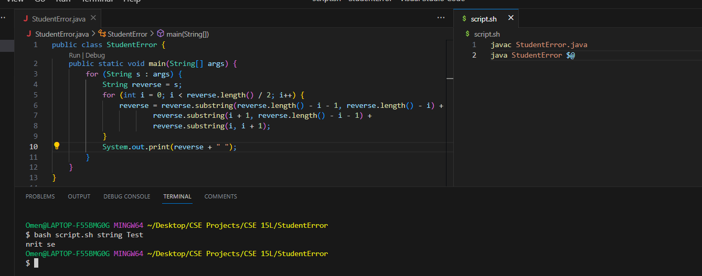
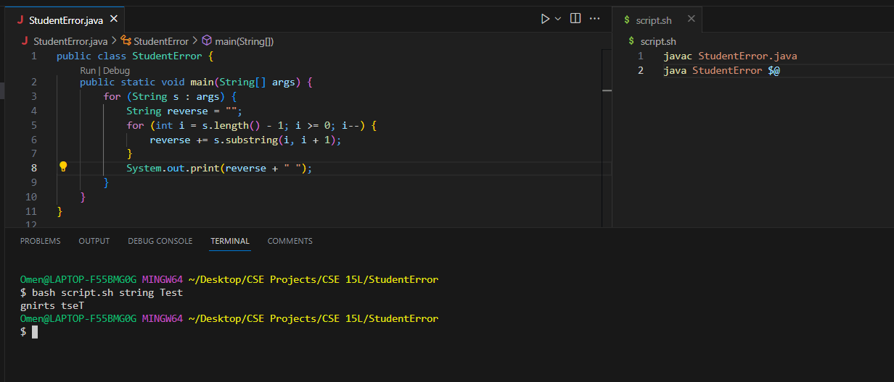

# Original Post
**What environment are you using (computer, operating system, web browser, terminal/editor, and so on)?**

I am using a windows computer with the VSCode editor. My terminal uses the integrated bash terminal within VSCode.

**Detail the symptom you're seeing. Be specific; include both what you're seeing and what you expected to see instead. Screenshots are great, copy-pasted terminal output is also great. Avoid saying “it doesn't work”.**

What I initially expected for my code to do is to reverse each string that is input into the terminal when running the bash script. When looking at the output, it appears the string is somewhat reversed, but not in the correct way while also missing some letters from the original words. Here is what the program looks like along with the output I received from the terminal.

**Detail the failure-inducing input and context. That might mean any or all of the command you're running, a test case, command-line arguments, working directory, even the last few commands you ran. Do your best to provide as much context as you can.**

The failure-inducing input is `bash script.sh string Test` which means there must be an issue with my implementation of the java file since I am able to run the program and all of the input values appear to be recognized when running the script.

# TA Suggestion

It appears when you work with each string in the array, you are trying to modify the values in-place even though that does not seem to be necessary. It is a good idea to try and see if there is a different approach so as to not overcomplicate what you are working with. Perhaps try using the `reverse` variable in a different way.

# New Student Version

It appeared that when I iterated through the for loop, the new string `result` was equal to would become artificially smaller as `i` increased. Instead I iterated backwards through the original string and added the elements into `result` which is certainly a much simpler approach to what I initially started with.

# Information About The Setup

**File and directory structure**

StudentError/
  -script.sh
  -StudentError.java

**Contents of each file BEFORE the bug**

Provided in the first screenshot.

**Command line to trigger the bug**

Also provided in the first screenshot.

**A description o what to edit to fix the bug**

Rather than having `result` equal the string in the original array and modifying it in-place, have it equal an empty string. This would allow one to iterate through the original string backwards and add to the new `result`.

# Reflection

