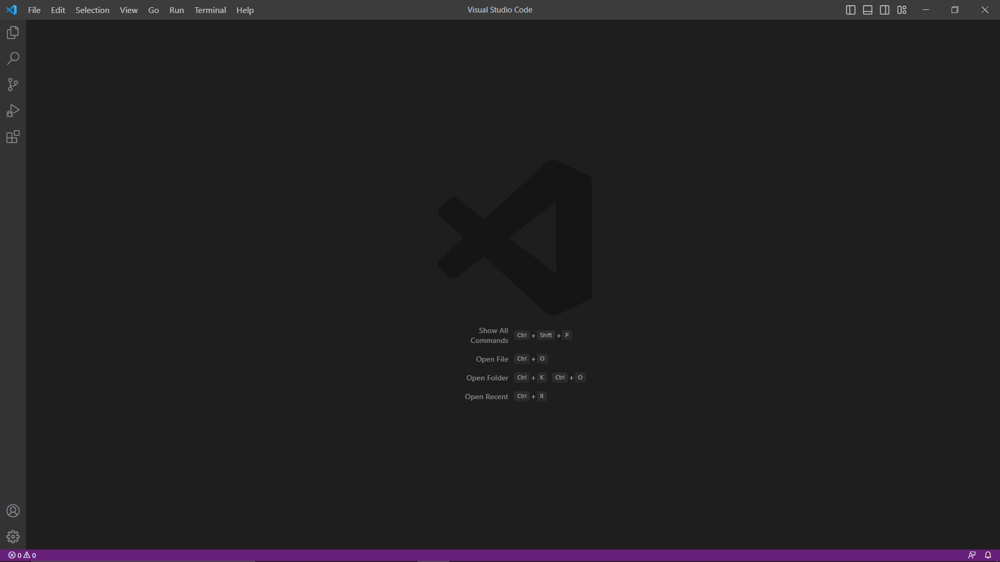
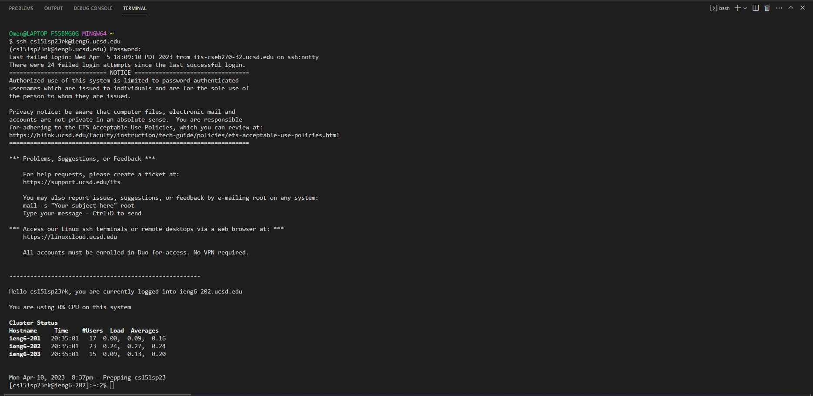
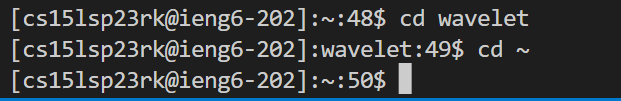
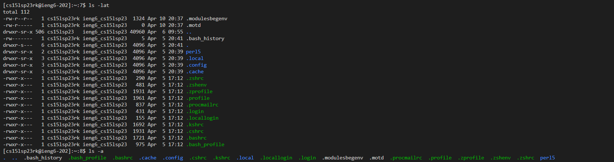

# Getting set up with remote connections
This website will act as a guide to get a remote connection going between the host computer you are using to access this website and a device in the Computer Science Building basement.
## Installing VSCode onto the computer
To access the page where you will download VSCode, follow this [link](https://code.visualstudio.com) to access the download page. *Make sure that you are downloading the correct version that suits your host computer by checking the dropdown options.* Once the download is successful, make sure to follow the instructions from the installer to make sure VSCode is properly set up on your device. You should be greeted to a window that looks like this when you open the program.



## Remotely accessing a computer with your host computer
If you are on a Windows device, make sure to download [Git](https://gitforwindows.org) as this will be necessary for future steps. Make sure to [follow the steps](https://stackoverflow.com/questions/42606837/how-do-i-use-bash-on-windows-from-the-visual-studio-code-integrated-terminal/50527994#50527994) to set bash as the default terminal because otherwise, you will be in the incorrect terminal and you will not be able to run any of the commands.

Now, with VSCode open, input <kbd>Ctrl</kbd>+ <kbd>`</kbd> to open a terminal and input this command...
```
  ssh cs15lsp23zz@ieng6.ucsd.edu
```
(replace zz with the appropriate account letters personalized for you)

If this is the first time you are connecting to the remote device, it will prompt to ensure that you wish to connect to the device. Type `yes` and continue on.
Now the terminal will prompt for a password, so you must input the password to the account and press `Enter` once the password is complete. Once the password is accepted, your screen should look like the image down below.



## Using commands on a remotely connected system
Now that you are successfully logged into the remote device, you can run any command you may desire as if it was your host device! If you like, you can run the following commands and see what happens with your terminal.
* `cd [path]` - changes the active directory that your machine is on
* `cd ~` - changes the directory to the user's home directory
* `ls -lat` - lists all files using `-l` `-a` and `-t` as constraints
* `ls -a` - lists all files using `a` as a constraint

Here is what happens if you were to run these commands through the remote connection.





Once you are done with the machine you can simply type `quit` and it will terminate the remote connection.
